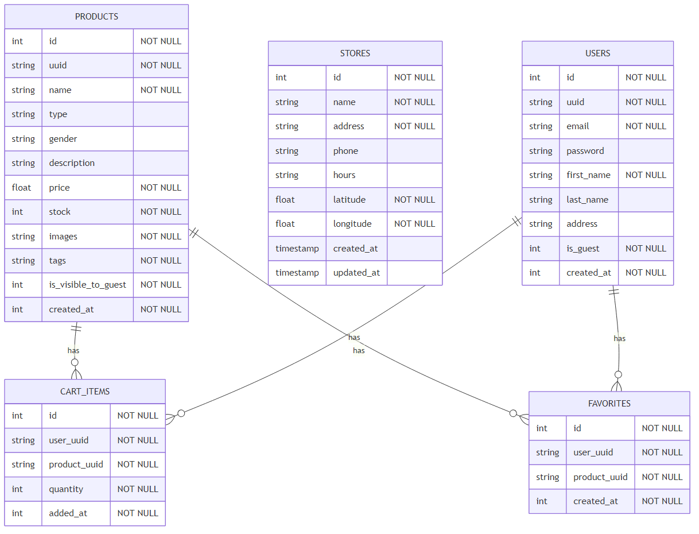

# Elite Couture 👔

Aplicación Android de e-commerce de moda desarrollada con Kotlin. Proyecto académico que implementa autenticación, catálogo de productos, carrito de compras, favoritos y sistema de filtrado por categorías.

## 🚀 Stack Tecnológico

- **Lenguaje:** Kotlin
- **Build:** Gradle 9.1.0
- **SDK:** Android 10+ (API 29-34)
- **IDE:** Visual Studio Code
- **Base de Datos:** SQLite
- **UI:** Material Design 3 + Coil 2.5.0

## 📦 Instalación

```bash
# Clonar repositorio
git clone https://github.com/emir-ucompensar/elite-couture.git
cd elite-couture

# Compilar APK
gradle assembleDebug

# Instalar en dispositivo/emulador
adb install app/build/outputs/apk/debug/app-debug.apk
```

---

## ✨ Funcionalidades

### ✅ Implementadas
- **Autenticación:** Login, registro y modo invitado
- **Perfil de Usuario:** Edición con validación y cifrado AES-256
- **Carrito de Compras:** Añadir/eliminar items, modificar cantidades
- **Favoritos:** Swipe-to-delete con opción de deshacer
- **Catálogo:** 25 productos con imágenes, filtrado por categorías y tags
- **Sistema de Tags:** Etiquetas visuales para clasificación de productos
- **Menú Lateral:** Navegación por categorías (Hombre/Mujer)
- **Base de Datos:** SQLite con 4 tablas relacionadas ([Ver ERD](scripting/schemas/exports/DATABASE_SCHEMA.md))

### 🔄 Próximamente
- Historial de pedidos
- Búsqueda de productos
- Sistema de reseñas

---

## 🏗️ Arquitectura

```
app/
├── data/              # Capa de datos (DAOs, entidades, repositorios)
├── domain/            # Lógica de negocio (modelos, casos de uso)
├── ui/                # Interfaz de usuario (fragments, adapters)
│   ├── common/        # Componentes compartidos
│   └── feature/       # Módulos por funcionalidad
└── util/              # Utilidades y helpers
```

**Patrones aplicados:** Repository, Use Case, Service Locator, MVVM ligero

### 📊 Base de Datos (v7)

- **users:** Autenticación y perfiles
- **products:** Catálogo con tags e imágenes
- **cart_items:** Carrito de compras
- **favorites:** Productos favoritos

**[Ver Diagrama ERD completo →](scripting/schemas/exports/DATABASE_SCHEMA.md)**



## 🛠️ Herramientas de Desarrollo

### Scripts Python (testing/)
- `generate_erd.py` - Genera diagrama ERD automáticamente
- `export_erd_to_png.py` - Exporta ERD a imagen PNG
- `copy_product_images_v1.py` - Procesa imágenes de productos
- `test_favorites.py` - Monitorea logs en tiempo real
- `check_favorites_db.py` - Consulta base de datos
- `helper.py` - Info del dispositivo y comandos útiles

**Requisitos:** Python 3.7+ y ADB instalado  
**[Ver documentación completa →](scripting/README.md)**

---

## 💡 Decisiones de Diseño

**¿Por qué VS Code en lugar de Android Studio?**
- Comprender la mecánica del sistema de build de Gradle
- Desarrollo por línea de comandos sin dependencia del IDE
- Mayor control sobre la configuración del proyecto

---

## 📝 Licencia

MIT License - Proyecto académico libre para uso educativo

## 👨‍💻 Autor

**Emir** - UCompensar

---

<div align="center">
  <strong>Elite Couture</strong> - Desarrollo Android Moderno 🚀
</div>
