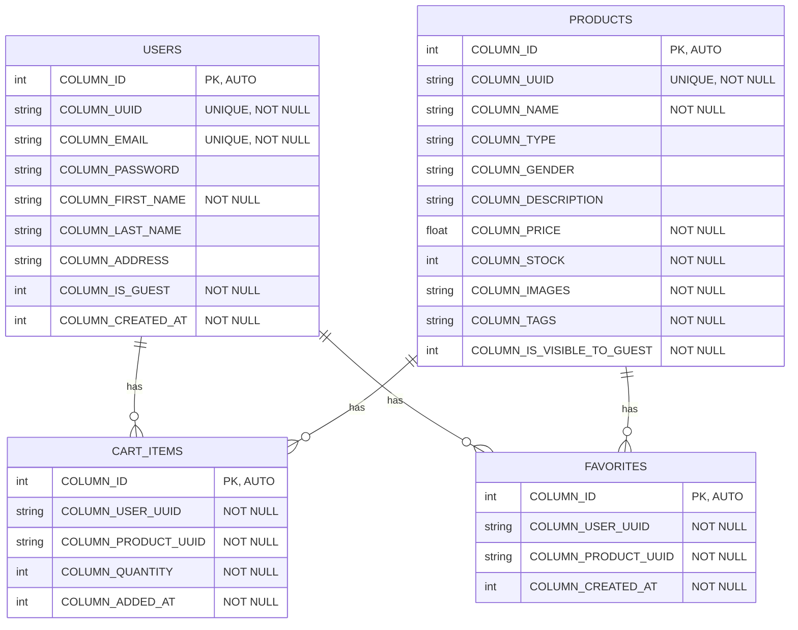

# Elite Couture - Diagrama de Base de Datos

Este documento fue generado automáticamente desde `DatabaseContract.kt`.

## Diagrama ERD

## Descripción de Tablas

### `users`

Almacena información de usuarios registrados y usuarios invitados.

| Columna | Tipo | Restricciones |
|---------|------|---------------|
| `COLUMN_ID` | INTEGER | PK, AUTO |
| `COLUMN_UUID` | TEXT | UNIQUE, NOT NULL |
| `COLUMN_EMAIL` | TEXT | UNIQUE, NOT NULL |
| `COLUMN_PASSWORD` | TEXT | - |
| `COLUMN_FIRST_NAME` | TEXT | NOT NULL |
| `COLUMN_LAST_NAME` | TEXT | - |
| `COLUMN_ADDRESS` | TEXT | - |
| `COLUMN_IS_GUEST` | INTEGER | NOT NULL |
| `COLUMN_CREATED_AT` | INTEGER | NOT NULL |

### `products`

Catálogo de productos de la tienda con imágenes, precios y tags para filtrado.

| Columna | Tipo | Restricciones |
|---------|------|---------------|
| `COLUMN_ID` | INTEGER | PK, AUTO |
| `COLUMN_UUID` | TEXT | UNIQUE, NOT NULL |
| `COLUMN_NAME` | TEXT | NOT NULL |
| `COLUMN_TYPE` | TEXT | - |
| `COLUMN_GENDER` | TEXT | - |
| `COLUMN_DESCRIPTION` | TEXT | - |
| `COLUMN_PRICE` | REAL | NOT NULL |
| `COLUMN_STOCK` | INTEGER | NOT NULL |
| `COLUMN_IMAGES` | TEXT | NOT NULL |
| `COLUMN_TAGS` | TEXT | NOT NULL |
| `COLUMN_IS_VISIBLE_TO_GUEST` | INTEGER | NOT NULL |

### `cart_items`

Items en el carrito de compras de cada usuario con cantidad.

| Columna | Tipo | Restricciones |
|---------|------|---------------|
| `COLUMN_ID` | INTEGER | PK, AUTO |
| `COLUMN_USER_UUID` | TEXT | NOT NULL |
| `COLUMN_PRODUCT_UUID` | TEXT | NOT NULL |
| `COLUMN_QUANTITY` | INTEGER | NOT NULL |
| `COLUMN_ADDED_AT` | INTEGER | NOT NULL |

**Foreign Keys:**

- `user_uuid` → `users.uuid`
- `product_uuid` → `products.uuid`

### `favorites`

Productos marcados como favoritos por cada usuario.

| Columna | Tipo | Restricciones |
|---------|------|---------------|
| `COLUMN_ID` | INTEGER | PK, AUTO |
| `COLUMN_USER_UUID` | TEXT | NOT NULL |
| `COLUMN_PRODUCT_UUID` | TEXT | NOT NULL |
| `COLUMN_CREATED_AT` | INTEGER | NOT NULL |

**Foreign Keys:**

- `user_uuid` → `users.uuid`
- `product_uuid` → `products.uuid`

## Relaciones

- **users** ↔ **cart_items**: Un usuario puede tener múltiples items en su carrito
- **users** ↔ **favorites**: Un usuario puede tener múltiples productos favoritos
- **products** ↔ **cart_items**: Un producto puede estar en múltiples carritos
- **products** ↔ **favorites**: Un producto puede ser favorito de múltiples usuarios

## Notas

- Versión de base de datos: 7
- Las columnas `images` y `tags` usan pipe (`|`) como separador
- Las relaciones tienen `ON DELETE CASCADE` para integridad referencial

---
*Generado automáticamente con `generate_erd.py`*